Biometry / Homework 2 / Auriel Fournier / March 6, 2014
========================================================

This is an R Markdown document. It allows me to write up my thoughts and also include the R script and outputs in one html document so that others can see exactly what I did, without having to open up R. It also allows for completely reproduceable homework if you do run the .Rmd document yourself. 

So first we have to set the working directory and get all the required packages loaded

```r
# When working on my mac

# setwd('~/Dropbox/R/Biometry_HW_2')

# when working on my desktop at school
setwd("C:/Users/avanderlaar/Dropbox/R/Biometry_HW_2")

library(lattice)
library(ggplot2)
library(sciplot)
library(psych)
```

```
## 
## Attaching package: 'psych'
## 
## The following object is masked from 'package:ggplot2':
## 
##     %+%
```


Then we import the data. In this case I've take the data I was given for this assignment and saved it as a .csv file.

```r
fish <- read.csv("Biometry_HW_2.csv", header = TRUE)
```


First we want to check and make sure the data imported correctly and also take a look at it and see what is included.

The head() command shows the first 6 rows of each column

```r
head(fish)
```

```
##    DATE SEASON SEASNUM  STREAM STREAMNUM STREAMTYPE REACH HABITAT V_NAME_
## 1 37718  April       4 Falling         3          1     1     Run  PopEst
## 2 37718  April       4 Falling         3          1     2  Riffle  PopEst
## 3 37718  April       4 Falling         3          1     3    Pool  PopEst
## 4 37718  April       4 Falling         3          1     4  Riffle  PopEst
## 5 37718  April       4 Falling         3          1     5    Pool  PopEst
## 6 37718  April       4 Falling         3          1     6     Run  PopEst
##   V_LABEL_ ALL CRC CSR DSS GSD LES NHS OTD OZM RBD SLM WTS BDS GSF HHC SMB
## 1   PopEst  94   1  17  34  24   0   0   1   0   8   0   0   0   0   0   0
## 2   PopEst  42   1  22   0   1   0   0   4   0   4   5   0   0   0   0   0
## 3   PopEst  88   3  43  14   1   0   4   0   2   2  18   5   0   0   0   0
## 4   PopEst 156  20  67   1   7   0   0  16   0  16  15   0   0   0   0   0
## 5   PopEst  25   0  11   2   2   1   0   1   3   0   5   0   0   0   0   0
## 6   PopEst  47   0  32  21   3   0   0   2   0   0   1   0   0   0   0   0
##   SRD STD AMM OZB BTM FTD NSF TSS RH BLG BES CKM  TEMP   DO   PH   SPC
## 1   0   0   0   0   0   0   0   0  0   0   0   0 9.585 0.91 6.17 15.35
## 2   0   0   0   0   0   0   0   0  0   0   0   0 9.585 0.91 6.17 15.35
## 3   0   0   0   0   0   0   0   0  0   0   0   0 9.585 0.91 6.17 15.35
## 4   0   0   0   0   0   0   0   0  0   0   0   0 9.585 0.91 6.17 15.35
## 5   0   0   0   0   0   0   0   0  0   0   0   0 9.585 0.91 6.17 15.35
## 6   0   0   0   0   0   0   0   0  0   0   0   0 9.585 0.91 6.17 15.35
##   LENGTH COVER  AREA  WIDTH CANOPY DEPTH VELOCITY SUBSTRATE VOLUME
## 1   26.1    25 128.4  4.920  50.00 17.00   15.867     5.267  21.83
## 2   11.7    60 125.2 10.700 106.67 11.33    8.556     4.444  14.19
## 3   42.0    15 359.4  8.557  49.29 46.57    3.762     5.524 167.38
## 4   67.6    80 535.4  7.920  64.00 15.13   12.433     4.167  81.02
## 5   22.3     8 193.1  8.660  83.00 47.20    1.267     5.200  91.15
## 6   23.8    15 123.2  5.175  90.00 27.83    4.417     4.750  34.28
##   TOTDENVOL COVERASN CANOPYASN TOTDENAREA TOTDNARLOG TOTNUMLOG VOLLOG
## 1    4.3060   14.485     30.02     0.7320    0.23855     1.973  1.339
## 2    2.9602   36.889        NA     0.3355    0.12564     1.623  1.152
## 3    0.5258    8.631     29.54     0.2449    0.09512     1.944  2.224
## 4    1.9254   53.157     39.81     0.2914    0.11105     2.193  1.909
## 5    0.2743    4.591     56.13     0.1295    0.05287     1.398  1.960
## 6    1.3710    8.631     64.19     0.3816    0.14038     1.672  1.535
##   TOTDENVOLLOG RICHNESS VELOCITYLOG DEPTHLOG SUBSTRATELOG CSRDNVOL
## 1       0.7248        6      1.2270    1.255       0.7970   0.7787
## 2       0.5977        6      0.9803    1.091       0.7360   1.5506
## 3       0.1835        9      0.6778    1.677       0.8145   0.2569
## 4       0.4662        7      1.1282    1.208       0.7132   0.8269
## 5       0.1053        7      0.3554    1.683       0.7924   0.1207
## 6       0.3749        5      0.7337    1.460       0.7597   0.9335
##   CSRDNVOLLOG CANOPYLOG COVERLOG OTDRBD OTDRBDDEN OTDRBDDNLOG
## 1     0.25011     1.699   1.3979      9   0.41228    0.149920
## 2     0.40664     2.028   1.7782      8   0.56385    0.194195
## 3     0.09930     1.693   1.1761      2   0.01195    0.005159
## 4     0.26172     1.806   1.9031     32   0.39495    0.144559
## 5     0.04948     1.919   0.9031      1   0.01097    0.004739
## 6     0.28634     1.954   1.1761      2   0.05834    0.024626
```


Then you always want to check the structure of the data, to make sure that all the variables were imported as the right kind of data


```r
str(fish)
```

```
## 'data.frame':	150 obs. of  70 variables:
##  $ DATE        : int  37718 37718 37718 37718 37718 37718 37718 37719 37719 37719 ...
##  $ SEASON      : Factor w/ 4 levels "April","August",..: 1 1 1 1 1 1 1 1 1 1 ...
##  $ SEASNUM     : int  4 4 4 4 4 4 4 4 4 4 ...
##  $ STREAM      : Factor w/ 6 levels "Bear","Cave",..: 3 3 3 3 3 3 3 2 2 2 ...
##  $ STREAMNUM   : int  3 3 3 3 3 3 3 2 2 2 ...
##  $ STREAMTYPE  : int  1 1 1 1 1 1 1 1 1 1 ...
##  $ REACH       : int  1 2 3 4 5 6 7 1 2 3 ...
##  $ HABITAT     : Factor w/ 3 levels "Pool","Riffle",..: 3 2 1 2 1 3 2 3 2 1 ...
##  $ V_NAME_     : Factor w/ 1 level "PopEst": 1 1 1 1 1 1 1 1 1 1 ...
##  $ V_LABEL_    : Factor w/ 1 level "PopEst": 1 1 1 1 1 1 1 1 1 1 ...
##  $ ALL         : int  94 42 88 156 25 47 44 848 507 225 ...
##  $ CRC         : int  1 1 3 20 0 0 1 77 15 25 ...
##  $ CSR         : int  17 22 43 67 11 32 19 395 217 101 ...
##  $ DSS         : int  34 0 14 1 2 21 0 8 0 0 ...
##  $ GSD         : int  24 1 1 7 2 3 1 0 0 0 ...
##  $ LES         : int  0 0 0 0 1 0 1 0 0 0 ...
##  $ NHS         : int  0 0 4 0 0 0 0 3 1 0 ...
##  $ OTD         : int  1 4 0 16 1 2 12 0 112 4 ...
##  $ OZM         : int  0 0 2 0 3 0 0 0 0 0 ...
##  $ RBD         : int  8 4 2 16 0 0 4 18 14 0 ...
##  $ SLM         : int  0 5 18 15 5 1 3 8 6 0 ...
##  $ WTS         : int  0 0 5 0 0 0 0 0 0 0 ...
##  $ BDS         : int  0 0 0 0 0 0 0 0 3 0 ...
##  $ GSF         : int  0 0 0 0 0 0 0 0 0 2 ...
##  $ HHC         : int  0 0 0 0 0 0 0 4 1 2 ...
##  $ SMB         : int  0 0 0 0 0 0 0 0 0 2 ...
##  $ SRD         : int  0 0 0 0 0 0 0 237 138 87 ...
##  $ STD         : int  0 0 0 0 0 0 0 3 6 0 ...
##  $ AMM         : int  0 0 0 0 0 0 0 0 0 0 ...
##  $ OZB         : int  0 0 0 0 0 0 0 0 0 0 ...
##  $ BTM         : int  0 0 0 0 0 0 0 0 0 0 ...
##  $ FTD         : int  0 0 0 0 0 0 0 0 0 0 ...
##  $ NSF         : int  0 0 0 0 0 0 0 0 0 0 ...
##  $ TSS         : int  0 0 0 0 0 0 0 0 0 0 ...
##  $ RH          : int  0 0 0 0 0 0 0 0 0 0 ...
##  $ BLG         : int  0 0 0 0 0 0 0 0 0 0 ...
##  $ BES         : int  0 0 0 0 0 0 0 0 0 0 ...
##  $ CKM         : int  0 0 0 0 0 0 0 0 0 0 ...
##  $ TEMP        : num  9.59 9.59 9.59 9.59 9.59 ...
##  $ DO          : num  0.91 0.91 0.91 0.91 0.91 0.91 0.91 0.985 0.985 0.985 ...
##  $ PH          : num  6.17 6.17 6.17 6.17 6.17 ...
##  $ SPC         : num  15.3 15.3 15.3 15.3 15.3 ...
##  $ LENGTH      : num  26.1 11.7 42 67.6 22.3 23.8 20.8 26.5 112 30.8 ...
##  $ COVER       : int  25 60 15 80 8 15 75 65 75 15 ...
##  $ AREA        : num  128 125 359 535 193 ...
##  $ WIDTH       : num  4.92 10.7 8.56 7.92 8.66 ...
##  $ CANOPY      : num  50 106.7 49.3 64 83 ...
##  $ DEPTH       : num  17 11.3 46.6 15.1 47.2 ...
##  $ VELOCITY    : num  15.87 8.56 3.76 12.43 1.27 ...
##  $ SUBSTRATE   : num  5.27 4.44 5.52 4.17 5.2 ...
##  $ VOLUME      : num  21.8 14.2 167.4 81 91.2 ...
##  $ TOTDENVOL   : num  4.306 2.96 0.526 1.925 0.274 ...
##  $ COVERASN    : num  14.48 36.89 8.63 53.16 4.59 ...
##  $ CANOPYASN   : num  30 NA 29.5 39.8 56.1 ...
##  $ TOTDENAREA  : num  0.732 0.335 0.245 0.291 0.129 ...
##  $ TOTDNARLOG  : num  0.2386 0.1256 0.0951 0.1111 0.0529 ...
##  $ TOTNUMLOG   : num  1.97 1.62 1.94 2.19 1.4 ...
##  $ VOLLOG      : num  1.34 1.15 2.22 1.91 1.96 ...
##  $ TOTDENVOLLOG: num  0.725 0.598 0.183 0.466 0.105 ...
##  $ RICHNESS    : int  6 6 9 7 7 5 7 9 10 7 ...
##  $ VELOCITYLOG : num  1.227 0.98 0.678 1.128 0.355 ...
##  $ DEPTHLOG    : num  1.26 1.09 1.68 1.21 1.68 ...
##  $ SUBSTRATELOG: num  0.797 0.736 0.815 0.713 0.792 ...
##  $ CSRDNVOL    : num  0.779 1.551 0.257 0.827 0.121 ...
##  $ CSRDNVOLLOG : num  0.2501 0.4066 0.0993 0.2617 0.0495 ...
##  $ CANOPYLOG   : num  1.7 2.03 1.69 1.81 1.92 ...
##  $ COVERLOG    : num  1.398 1.778 1.176 1.903 0.903 ...
##  $ OTDRBD      : int  9 8 2 32 1 2 16 18 126 4 ...
##  $ OTDRBDDEN   : num  0.4123 0.5638 0.0119 0.395 0.011 ...
##  $ OTDRBDDNLOG : num  0.14992 0.19419 0.00516 0.14456 0.00474 ...
```


Then you often want to look at the very basic stats of each variable, and you can do that via this command


```r
summary(fish)
```

```
##       DATE           SEASON      SEASNUM           STREAM     STREAMNUM   
##  Min.   :37718   April  :36   Min.   : 4.00   Bear    :27   Min.   :1.00  
##  1st Qu.:37775   August :38   1st Qu.: 6.00   Cave    :18   1st Qu.:2.00  
##  Median :37783   June   :41   Median : 6.00   Falling :28   Median :4.00  
##  Mean   :37807   October:35   Mean   : 6.96   Sylamore:19   Mean   :3.59  
##  3rd Qu.:37846                3rd Qu.: 8.00   Tomahawk:33   3rd Qu.:5.00  
##  Max.   :37899                Max.   :10.00   Water   :25   Max.   :6.00  
##                                                                           
##    STREAMTYPE       REACH        HABITAT     V_NAME_      V_LABEL_  
##  Min.   :1.00   Min.   :1.00   Pool  :46   PopEst:150   PopEst:150  
##  1st Qu.:1.00   1st Qu.:2.00   Riffle:58                            
##  Median :2.00   Median :4.00   Run   :46                            
##  Mean   :1.51   Mean   :3.79                                        
##  3rd Qu.:2.00   3rd Qu.:5.00                                        
##  Max.   :2.00   Max.   :9.00                                        
##                                                                     
##       ALL             CRC             CSR             DSS      
##  Min.   :  4.0   Min.   : 0.00   Min.   :  0.0   Min.   : 0.0  
##  1st Qu.: 79.5   1st Qu.: 0.00   1st Qu.: 10.2   1st Qu.: 1.0  
##  Median :137.5   Median : 0.00   Median : 41.0   Median : 8.0  
##  Mean   :178.7   Mean   : 6.91   Mean   : 77.7   Mean   :12.1  
##  3rd Qu.:234.8   3rd Qu.: 7.00   3rd Qu.:101.8   3rd Qu.:17.0  
##  Max.   :883.0   Max.   :86.00   Max.   :395.0   Max.   :80.0  
##                                                                
##       GSD             LES              NHS            OTD       
##  Min.   : 0.00   Min.   : 0.000   Min.   :0.00   Min.   :  0.0  
##  1st Qu.: 0.00   1st Qu.: 0.000   1st Qu.:0.00   1st Qu.:  1.0  
##  Median : 0.00   Median : 0.000   Median :0.00   Median :  6.0  
##  Mean   : 1.37   Mean   : 0.727   Mean   :0.26   Mean   : 14.2  
##  3rd Qu.: 1.00   3rd Qu.: 0.000   3rd Qu.:0.00   3rd Qu.: 17.0  
##  Max.   :36.00   Max.   :22.000   Max.   :4.00   Max.   :195.0  
##                                                                 
##       OZM              RBD             SLM             WTS       
##  Min.   : 0.000   Min.   : 0.00   Min.   : 0.00   Min.   : 0.00  
##  1st Qu.: 0.000   1st Qu.: 0.00   1st Qu.: 0.00   1st Qu.: 0.00  
##  Median : 0.000   Median : 0.00   Median : 1.00   Median : 0.00  
##  Mean   : 0.967   Mean   : 3.53   Mean   : 2.51   Mean   : 1.19  
##  3rd Qu.: 0.000   3rd Qu.: 3.00   3rd Qu.: 3.00   3rd Qu.: 0.00  
##  Max.   :30.000   Max.   :51.00   Max.   :28.00   Max.   :23.00  
##                                                                  
##       BDS             GSF              HHC             SMB       
##  Min.   : 0.00   Min.   : 0.000   Min.   : 0.00   Min.   :0.000  
##  1st Qu.: 0.00   1st Qu.: 0.000   1st Qu.: 0.00   1st Qu.:0.000  
##  Median : 2.00   Median : 0.000   Median : 1.00   Median :0.000  
##  Mean   : 7.11   Mean   : 0.393   Mean   : 2.38   Mean   :0.373  
##  3rd Qu.:11.75   3rd Qu.: 0.000   3rd Qu.: 3.00   3rd Qu.:0.000  
##  Max.   :81.00   Max.   :21.000   Max.   :21.00   Max.   :8.000  
##                                                                  
##       SRD             STD             AMM             OZB       
##  Min.   :  0.0   Min.   : 0.00   Min.   :0.000   Min.   :0.000  
##  1st Qu.:  0.0   1st Qu.: 0.00   1st Qu.:0.000   1st Qu.:0.000  
##  Median :  9.0   Median : 0.00   Median :0.000   Median :0.000  
##  Mean   : 39.7   Mean   : 0.66   Mean   :0.327   Mean   :0.327  
##  3rd Qu.: 59.8   3rd Qu.: 0.00   3rd Qu.:0.000   3rd Qu.:0.000  
##  Max.   :302.0   Max.   :20.00   Max.   :5.000   Max.   :7.000  
##                                                                 
##       BTM             FTD             NSF            TSS       
##  Min.   :0.000   Min.   : 0.00   Min.   :0.00   Min.   :0.000  
##  1st Qu.:0.000   1st Qu.: 0.00   1st Qu.:0.00   1st Qu.:0.000  
##  Median :0.000   Median : 0.00   Median :0.00   Median :0.000  
##  Mean   :0.193   Mean   : 1.18   Mean   :0.22   Mean   :0.087  
##  3rd Qu.:0.000   3rd Qu.: 0.00   3rd Qu.:0.00   3rd Qu.:0.000  
##  Max.   :7.000   Max.   :67.00   Max.   :7.00   Max.   :5.000  
##                                                                
##        RH             BLG              BES            CKM        
##  Min.   :0.000   Min.   :0.0000   Min.   :0.00   Min.   :0.0000  
##  1st Qu.:0.000   1st Qu.:0.0000   1st Qu.:0.00   1st Qu.:0.0000  
##  Median :0.000   Median :0.0000   Median :0.00   Median :0.0000  
##  Mean   :0.073   Mean   :0.0667   Mean   :0.02   Mean   :0.0133  
##  3rd Qu.:0.000   3rd Qu.:0.0000   3rd Qu.:0.00   3rd Qu.:0.0000  
##  Max.   :5.000   Max.   :3.0000   Max.   :1.00   Max.   :2.0000  
##                                                                  
##       TEMP             DO             PH            SPC       
##  Min.   : 9.01   Min.   :0.52   Min.   :6.17   Min.   : 15.3  
##  1st Qu.:14.81   1st Qu.:0.77   1st Qu.:6.62   1st Qu.: 32.9  
##  Median :17.44   Median :0.88   Median :7.46   Median :269.8  
##  Mean   :17.10   Mean   :0.86   Mean   :7.24   Mean   :195.6  
##  3rd Qu.:19.32   3rd Qu.:0.98   3rd Qu.:7.77   3rd Qu.:359.4  
##  Max.   :29.35   Max.   :1.09   Max.   :7.98   Max.   :404.8  
##  NA's   :57      NA's   :57     NA's   :57     NA's   :57     
##      LENGTH          COVER           AREA            WIDTH      
##  Min.   : 11.3   Min.   : 1.0   Min.   :  41.9   Min.   : 2.08  
##  1st Qu.: 19.6   1st Qu.:11.5   1st Qu.: 104.9   1st Qu.: 4.91  
##  Median : 25.8   Median :20.0   Median : 158.1   Median : 6.15  
##  Mean   : 32.0   Mean   :27.1   Mean   : 211.4   Mean   : 6.46  
##  3rd Qu.: 38.3   3rd Qu.:35.0   3rd Qu.: 276.2   3rd Qu.: 7.96  
##  Max.   :112.0   Max.   :90.0   Max.   :1201.8   Max.   :16.40  
##                  NA's   :18                                     
##      CANOPY          DEPTH          VELOCITY        SUBSTRATE   
##  Min.   : 10.0   Min.   : 1.56   Min.   : 0.000   Min.   :3.17  
##  1st Qu.: 35.0   1st Qu.:11.42   1st Qu.: 0.667   1st Qu.:3.86  
##  Median : 43.9   Median :17.41   Median : 2.185   Median :4.22  
##  Mean   : 45.6   Mean   :20.64   Mean   : 4.118   Mean   :4.32  
##  3rd Qu.: 55.0   3rd Qu.:25.90   3rd Qu.: 6.095   3rd Qu.:4.75  
##  Max.   :106.7   Max.   :80.24   Max.   :23.500   Max.   :5.75  
##  NA's   :23                                                     
##      VOLUME         TOTDENVOL        COVERASN       CANOPYASN    
##  Min.   :  1.02   Min.   : 0.24   Min.   : 0.57   Min.   : 5.74  
##  1st Qu.: 15.98   1st Qu.: 2.51   1st Qu.: 6.61   1st Qu.:20.50  
##  Median : 30.32   Median : 4.15   Median :11.54   Median :26.00  
##  Mean   : 47.25   Mean   : 6.97   Mean   :16.36   Mean   :27.61  
##  3rd Qu.: 57.41   3rd Qu.: 8.45   3rd Qu.:20.50   3rd Qu.:33.29  
##  Max.   :308.36   Max.   :47.03   Max.   :64.19   Max.   :69.00  
##                                   NA's   :18      NA's   :24     
##    TOTDENAREA      TOTDNARLOG       TOTNUMLOG         VOLLOG      
##  Min.   :0.061   Min.   :0.0257   Min.   :0.602   Min.   :0.0096  
##  1st Qu.:0.385   1st Qu.:0.1415   1st Qu.:1.900   1st Qu.:1.2034  
##  Median :0.783   Median :0.2512   Median :2.138   Median :1.4817  
##  Mean   :1.062   Mean   :0.2780   Mean   :2.095   Mean   :1.4593  
##  3rd Qu.:1.385   3rd Qu.:0.3776   3rd Qu.:2.371   3rd Qu.:1.7590  
##  Max.   :7.799   Max.   :0.9444   Max.   :2.946   Max.   :2.4891  
##                                                                   
##   TOTDENVOLLOG       RICHNESS      VELOCITYLOG       DEPTHLOG    
##  Min.   :0.0938   Min.   : 1.00   Min.   :0.000   Min.   :0.407  
##  1st Qu.:0.5457   1st Qu.: 6.25   1st Qu.:0.222   1st Qu.:1.094  
##  Median :0.7118   Median : 8.00   Median :0.503   Median :1.265  
##  Mean   :0.7615   Mean   : 7.91   Mean   :0.540   Mean   :1.262  
##  3rd Qu.:0.9754   3rd Qu.: 9.00   3rd Qu.:0.851   3rd Qu.:1.430  
##  Max.   :1.6815   Max.   :14.00   Max.   :1.389   Max.   :1.910  
##                                                                  
##   SUBSTRATELOG      CSRDNVOL       CSRDNVOLLOG      CANOPYLOG   
##  Min.   :0.620   Min.   : 0.000   Min.   :0.000   Min.   :1.00  
##  1st Qu.:0.687   1st Qu.: 0.428   1st Qu.:0.155   1st Qu.:1.54  
##  Median :0.718   Median : 1.096   Median :0.321   Median :1.64  
##  Mean   :0.723   Mean   : 2.669   Mean   :0.401   Mean   :1.62  
##  3rd Qu.:0.760   3rd Qu.: 2.670   3rd Qu.:0.565   3rd Qu.:1.74  
##  Max.   :0.829   Max.   :29.652   Max.   :1.486   Max.   :2.03  
##                                                   NA's   :23    
##     COVERLOG        OTDRBD        OTDRBDDEN       OTDRBDDNLOG    
##  Min.   :0.00   Min.   :  0.0   Min.   : 0.000   Min.   :0.0000  
##  1st Qu.:1.06   1st Qu.:  5.0   1st Qu.: 0.142   1st Qu.:0.0575  
##  Median :1.30   Median : 10.0   Median : 0.400   Median :0.1462  
##  Mean   :1.30   Mean   : 17.8   Mean   : 0.877   Mean   :0.2018  
##  3rd Qu.:1.54   3rd Qu.: 24.0   3rd Qu.: 0.806   3rd Qu.:0.2568  
##  Max.   :1.95   Max.   :211.0   Max.   :10.511   Max.   :1.0611  
##  NA's   :18
```


This provides summary stats by group

SEASON

```r
describeBy(fish$TOTDENVOL, group = fish$SEASNUM)
```

```
## group: 4
##   vars  n mean   sd median trimmed  mad  min   max range skew kurtosis
## 1    1 36 5.51 7.64   3.09    4.13 2.51 0.27 43.44 43.17 3.51    14.21
##     se
## 1 1.27
## -------------------------------------------------------- 
## group: 6
##   vars  n mean   sd median trimmed mad  min   max range skew kurtosis   se
## 1    1 41 4.71 3.34   3.56    4.35 2.4 0.24 15.94  15.7 1.13     1.29 0.52
## -------------------------------------------------------- 
## group: 8
##   vars  n mean   sd median trimmed  mad  min   max range skew kurtosis
## 1    1 38 9.29 6.89    7.9    8.55 5.99 0.49 29.28  28.8 1.03     0.62
##     se
## 1 1.12
## -------------------------------------------------------- 
## group: 10
##   vars  n mean    sd median trimmed mad  min   max range skew kurtosis
## 1    1 35 8.61 11.05   3.61    6.29 2.7 1.17 47.03 45.87 2.03     3.38
##     se
## 1 1.87
```

Stream Type

```r
describeBy(fish$TOTDENVOL, group = fish$STREAMTYPE)
```

```
## group: 1
##   vars  n mean   sd median trimmed  mad  min   max range skew kurtosis
## 1    1 73 7.27 8.69   3.91    5.51 3.66 0.24 47.03 46.79 2.42     6.61
##     se
## 1 1.02
## -------------------------------------------------------- 
## group: 2
##   vars  n mean   sd median trimmed  mad  min   max range skew kurtosis
## 1    1 77  6.7 6.82   5.05    5.48 4.49 0.37 43.44 43.07 2.84     10.7
##     se
## 1 0.78
```


Graphical Examination
========================================================

Box Plots
---------------------------------------------------------

```r
plot(fish$TOTDENVOL ~ as.factor(fish$SEASNUM), ylab = "Fish Density", xlab = "Season")
```

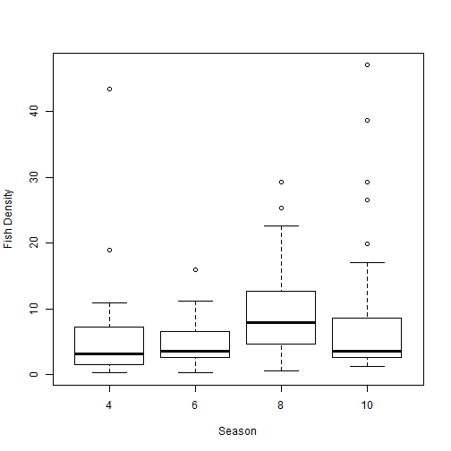 

### Figure 1


```r
png(filename = "seasonbox.png")
plot(fish$TOTDENVOL ~ as.factor(fish$SEASNUM), ylab = "Fish Density", xlab = "Season")
dev.off()
```

```
## pdf 
##   2
```


```r
plot(fish$TOTDENVOL ~ as.factor(fish$STREAMTYPE), ylab = "Fish Density", xlab = "Stream Type")
```

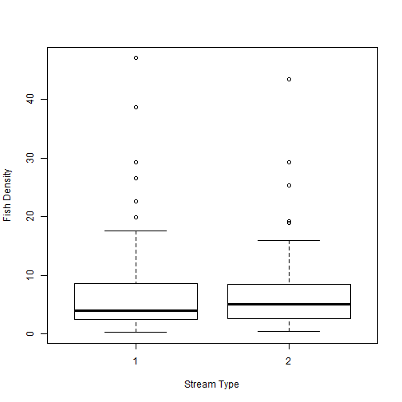 

### Figure 2


```r
png(filename = "streambox.png")
plot(fish$TOTDENVOL ~ as.factor(fish$STREAMTYPE), ylab = "Fish Density", xlab = "Stream Type")
dev.off()
```

```
## pdf 
##   2
```


Histograms
-------------------------------------------------------------------


```r
histogram(~TOTDENVOL | SEASNUM, fish, xlab = "Fish Density")
```

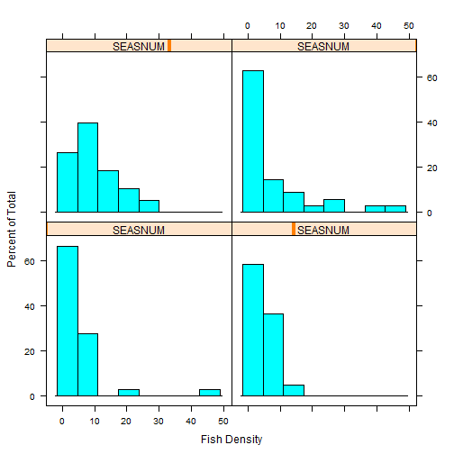 

### Figure 3

```r
png(filename = "seasonhist.png")
histogram(~TOTDENVOL | SEASNUM, fish, xlab = "Fish Density")
dev.off()
```

```
## pdf 
##   2
```


```r
histogram(~TOTDENVOL | STREAMTYPE, fish, xlab = "Fish Density")
```

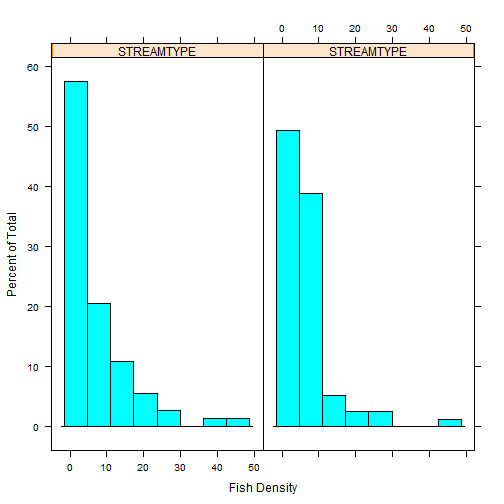 

### Figure 4

```r
png(filename = "streamhist.png")
histogram(~TOTDENVOL | STREAMTYPE, fish, xlab = "Fish Density")
dev.off()
```

```
## pdf 
##   2
```


Square-root Transformation
------------------------------------------


```r
fish[, 71] = sqrt(fish$TOTDENVOL)
```


Bar Plots
---------------

```r
plot(fish$V71 ~ as.factor(fish$SEASNUM), ylab = "Fish Density", xlab = "Season")
```

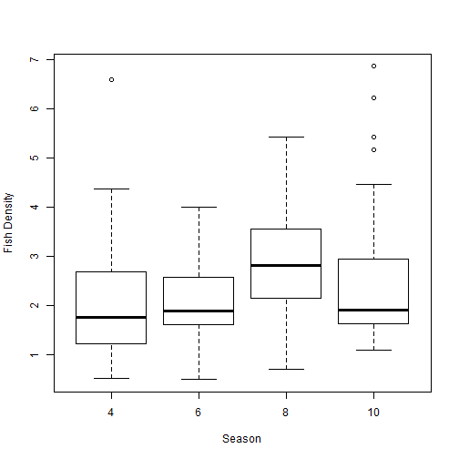 

### Figure 5

```r
png(filename = "squareboxseason.png")
plot(fish$V71 ~ as.factor(fish$SEASNUM), ylab = "Fish Density", xlab = "Season")
dev.off()
```

```
## pdf 
##   2
```


```r
plot(fish$V71 ~ as.factor(fish$STREAMTYPE), ylab = "Fish Density", xlab = "Stream Type")
```

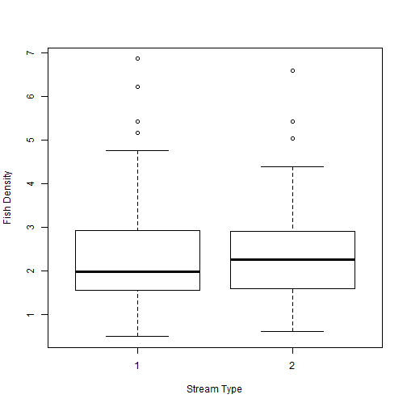 

### Figure 6

```r
png(filename = "squareboxstream.png")
plot(fish$V71 ~ as.factor(fish$STREAMTYPE), ylab = "Fish Density", xlab = "Stream Type")
dev.off()
```

```
## pdf 
##   2
```


Histograms
-----------------

```r
histogram(~V71 | SEASNUM, fish, xlab = "Fish Density")
```

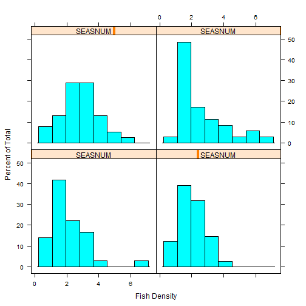 

### Figure 7

```r
png(filename = "squareseasonhist.png")
histogram(~V71 | SEASNUM, fish, xlab = "Fish Density")
dev.off()
```

```
## pdf 
##   2
```


```r
histogram(~V71 | STREAMTYPE, fish, xlab = "Fish Density")
```

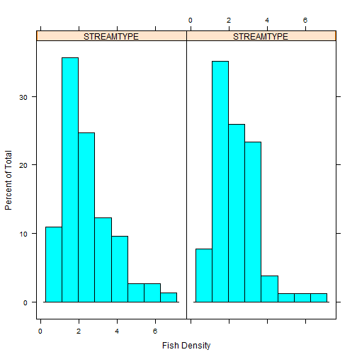 

### Figure 8

```r
png(filename = "squarestreamhist.png")
histogram(~V71 | STREAMTYPE, fish, xlab = "Fish Density")
dev.off()
```

```
## pdf 
##   2
```


4th-root transformation
------------------------


```r

fish[, 72] = fish$V71^(1/4)
```

Bar Plot
--------------------

```r
plot(fish$V72 ~ as.factor(fish$SEASNUM), ylab = "Fish Density", xlab = "Season")
```

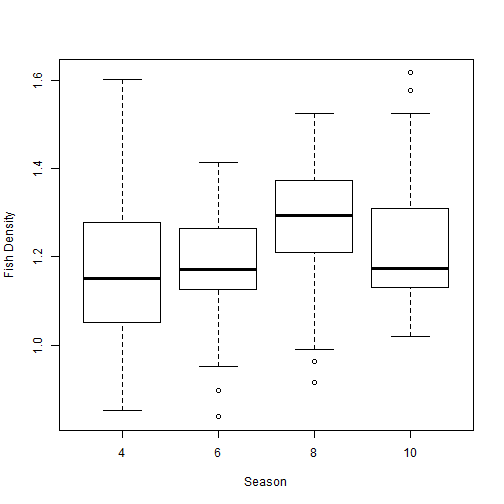 

### Figure 9

```r
png(filename = "fourboxseason.png")
plot(fish$V72 ~ as.factor(fish$SEASNUM), ylab = "Fish Density", xlab = "Season")
dev.off()
```

```
## pdf 
##   2
```


```r
plot(fish$V72 ~ as.factor(fish$STREAMTYPE), ylab = "Fish Density", xlab = "Stream Type")
```

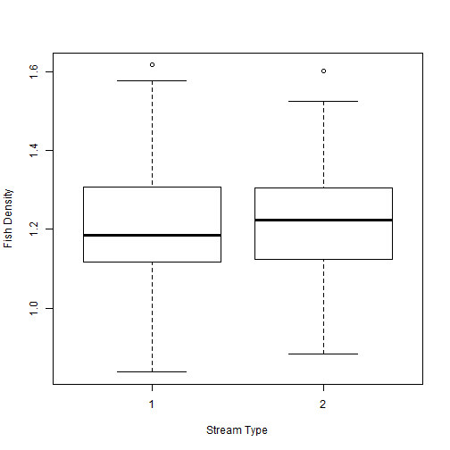 

### Figure 10

```r
png(filename = "fourboxstream.png")
plot(fish$V72 ~ as.factor(fish$STREAMTYPE), ylab = "Fish Density", xlab = "Stream Type")
dev.off()
```

```
## pdf 
##   2
```

Histogram
------------------

```r
histogram(~V72 | SEASNUM, fish, xlab = "Fish Density")
```

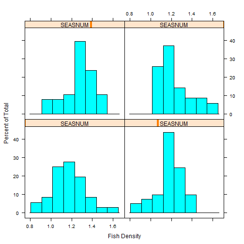 

### Figure 11

```r
png(filename = "fourhistseason.png")
histogram(~V72 | SEASNUM, fish, xlab = "Fish Density")
dev.off()
```

```
## pdf 
##   2
```


```r
histogram(~V72 | STREAMTYPE, fish, xlab = "Fish Density")
```

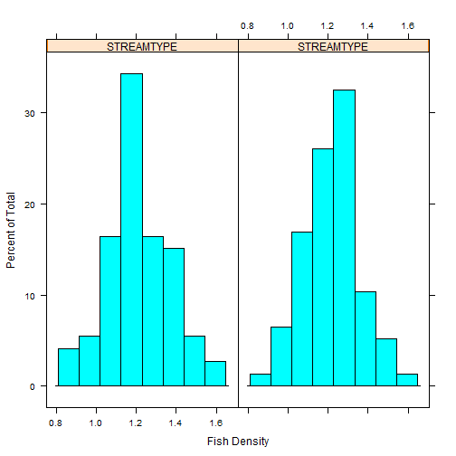 

### Figure 12

```r
png(filename = "fourhiststream.png")
histogram(~V72 | STREAMTYPE, fish, xlab = "Fish Density")
dev.off()
```

```
## pdf 
##   2
```


Two-Way ANOVA
========================================================

Two-Way ANOVA on our data looking at the interaction between season and stream type with our fourth-root transformed fish density variable as the response 


```r
options(contrasts = c("contr.sum", "contr.poly"))
model <- lm(V72 ~ STREAMTYPE * SEASNUM, data = fish)
anova_two <- anova(model)
```


```r
layout(matrix(c(1, 2, 3, 4), 2, 2))
plot(model)
```

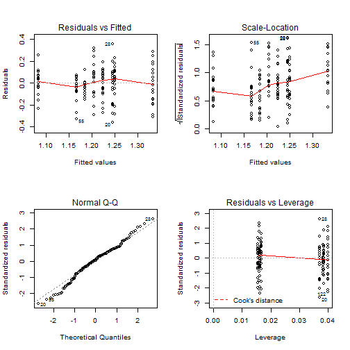 

### Figure 13

```r
png(filename = "TwoANOVA.png")
layout(matrix(c(1, 2, 3, 4), 2, 2))
plot(model)
dev.off()
```

```
## pdf 
##   2
```


### Table 1

```r
print(anova_two)
```

```
## Analysis of Variance Table
## 
## Response: V72
##                     Df Sum Sq Mean Sq F value  Pr(>F)    
## STREAMTYPE           1  0.003   0.003    0.14  0.7136    
## SEASNUM              1  0.168   0.168    8.64  0.0038 ** 
## STREAMTYPE:SEASNUM   1  0.477   0.477   24.59 1.9e-06 ***
## Residuals          146  2.832   0.019                    
## ---
## Signif. codes:  0 '***' 0.001 '**' 0.01 '*' 0.05 '.' 0.1 ' ' 1
```


Residual Plot
-------------------

```r
fish.df <- data.frame(M1_Fit = seq(0, 0, length = 150), M1_Resid = seq(0, 0, 
    length = 150), Season = seq(0, 0, length = 150), Stream = seq(0, 0, length = 150))

fish.resid = resid(model)
fish.fitted = fitted(model)

fish.df$M1_Fit = fish.fitted
fish.df$M1_Resid = fish.resid
fish.df$Season = fish$SEASNUM
fish.df$Stream = fish$STREAMNUM

ggplot(fish.df, aes(M1_Fit, M1_Resid, colour = Stream)) + geom_point() + xlab("Fitted Values") + 
    ylab("Residuals") + ggtitle("Residuals of Two-way Anova")
```

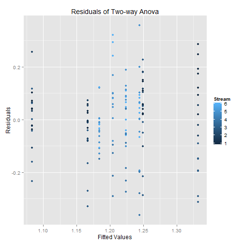 

### Figure 14

```r
png(filename = "TwoANOVAResidual.png")
ggplot(fish.df, aes(M1_Fit, M1_Resid, colour = Stream)) + geom_point() + xlab("Fitted Values") + 
    ylab("Residuals") + ggtitle("Residuals of Two-way Anova")
dev.off()
```

```
## pdf 
##   2
```


Interaction Plot
-------------------------

```r

lineplot.CI(SEASNUM, V72, group = STREAMTYPE, data = fish, cex = 1.5, xlab = "Season", 
    ylab = "means", cex.lab = 1.2, x.leg = 1, col = c("blue", "red"), pch = c(16, 
        16))
```

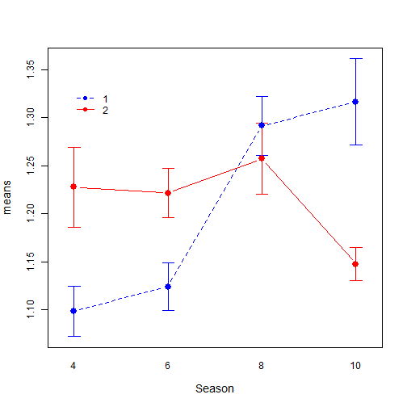 

### Figure 15

```r
png(filename = "TwoANOVAInteraction.png")
lineplot.CI(SEASNUM, V72, group = STREAMTYPE, data = fish, cex = 1.5, xlab = "Season", 
    ylab = "means", cex.lab = 1.2, x.leg = 1, col = c("blue", "red"), pch = c(16, 
        16))
dev.off()
```

```
## pdf 
##   2
```

```r

```


One-Way ANOVA On Stream
========================================================


```r
options(contrasts = c("contr.sum", "contr.poly"))
stream <- lm(V72 ~ STREAMTYPE, data = fish)
```


```r
layout(matrix(c(1, 2, 3, 4), 2, 2))
plot(stream)
```

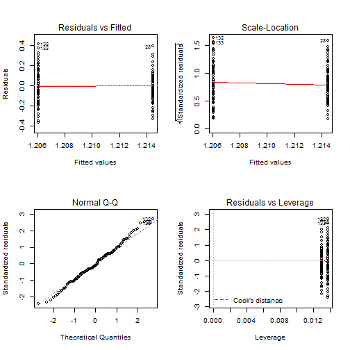 

### Figure 16

```r
png(filename = "OneANOVAStream.png")
layout(matrix(c(1, 2, 3, 4), 2, 2))
plot(stream)
dev.off()
```

```
## pdf 
##   2
```


### Table 2 

```r
print(anova(stream))
```

```
## Analysis of Variance Table
## 
## Response: V72
##             Df Sum Sq Mean Sq F value Pr(>F)
## STREAMTYPE   1   0.00 0.00262    0.11   0.74
## Residuals  148   3.48 0.02349
```


Residual Plot
--------------------

```r
stream.df <- data.frame(M1_Fit = seq(0, 0, length = 150), M1_Resid = seq(0, 
    0, length = 150), Stream = seq(0, 0, length = 150))

stream.resid = resid(stream)
stream.fitted = fitted(stream)

stream.df$M1_Fit = stream.fitted
stream.df$M1_Resid = stream.resid
stream.df$Stream = fish$STREAMNUM

ggplot(stream.df, aes(M1_Fit, M1_Resid, colour = Stream)) + geom_point() + xlab("Fitted Values") + 
    ylab("Residuals") + ggtitle("Residuals of One-Way Anova on Stream Type")
```

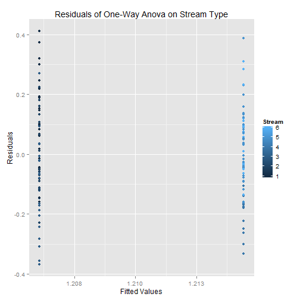 

### Figure 17

```r
png(filename = "OneANOVAStreamResidual.png")
ggplot(stream.df, aes(M1_Fit, M1_Resid, colour = Stream)) + geom_point() + xlab("Fitted Values") + 
    ylab("Residuals") + ggtitle("Residuals of One-Way Anova on Stream Type")
dev.off()
```

```
## pdf 
##   2
```


Interaction Plot
-----------------

```r
lineplot.CI(STREAMTYPE, V72, data = fish, cex = 1.5, xlab = "Season", ylab = "means", 
    cex.lab = 1.2, x.leg = 1, pch = c(16, 16))
```

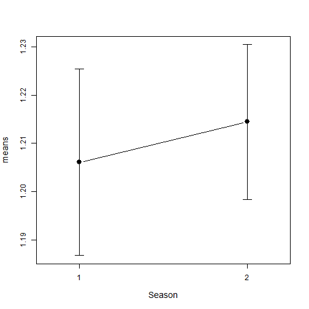 

### Figure 18

```r
png(filename = "OneANOVAStreamInteraction.png")
lineplot.CI(STREAMTYPE, V72, data = fish, cex = 1.5, xlab = "Season", ylab = "means", 
    cex.lab = 1.2, x.leg = 1, pch = c(16, 16))
dev.off()
```

```
## pdf 
##   2
```


One-Way ANOVA On Season
========================================================

Now lets look at a One-way ANOVA on season


```r
options(contrasts = c("contr.sum", "contr.poly"))
season <- lm(V72 ~ SEASNUM, data = fish)
```


```r
layout(matrix(c(1, 2, 3, 4), 2, 2))
plot(season)
```

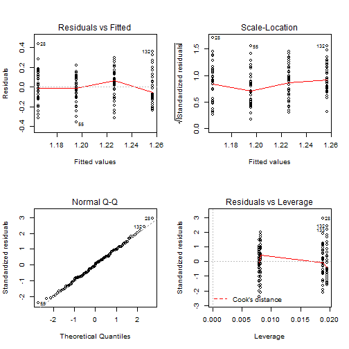 

### Figure 19

```r
png(filename = "OneANOVA.png")
layout(matrix(c(1, 2, 3, 4), 2, 2))
plot(season)
dev.off()
```

```
## pdf 
##   2
```


### Table 3

```r
print(anova(season))
```

```
## Analysis of Variance Table
## 
## Response: V72
##            Df Sum Sq Mean Sq F value Pr(>F)   
## SEASNUM     1   0.17  0.1677    7.49  0.007 **
## Residuals 148   3.31  0.0224                  
## ---
## Signif. codes:  0 '***' 0.001 '**' 0.01 '*' 0.05 '.' 0.1 ' ' 1
```


Residual Plot
-----------------

```r
season.df <- data.frame(M1_Fit = seq(0, 0, length = 150), M1_Resid = seq(0, 
    0, length = 150), Season = seq(0, 0, length = 150))

season.resid = resid(season)
season.fitted = fitted(season)

season.df$M1_Fit = season.fitted
season.df$M1_Resid = season.resid
season.df$Season = fish$SEASNUM

ggplot(season.df, aes(M1_Fit, M1_Resid, colour = Season)) + geom_point() + xlab("Fitted Values") + 
    ylab("Residuals") + ggtitle("Residuals of One-Way Anova on Season")
```

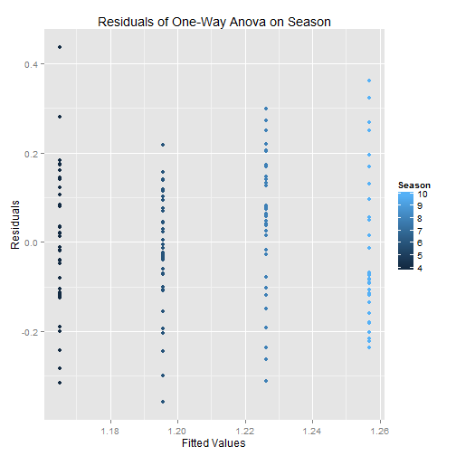 

### Figure 20

```r
png(filename = "OneANOVASeasonResidual.png")
ggplot(season.df, aes(M1_Fit, M1_Resid, colour = Season)) + geom_point() + xlab("Fitted Values") + 
    ylab("Residuals") + ggtitle("Residuals of One-Way Anova on Season")

dev.off()
```

```
## pdf 
##   2
```

```r

```


Interaction Plot
-------------------

```r
lineplot.CI(SEASNUM, V72, data = fish, cex = 1.5, xlab = "Season", ylab = "means", 
    cex.lab = 1.2, x.leg = 1, pch = c(16, 16))
```

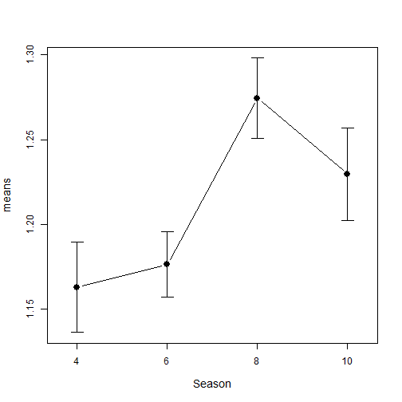 

### Figure 21

```r
png(filename = "OneANOVASeasonInteraction.png")
lineplot.CI(SEASNUM, V72, data = fish, cex = 1.5, xlab = "Season", ylab = "means", 
    cex.lab = 1.2, x.leg = 1, pch = c(16, 16))
dev.off()
```

```
## pdf 
##   2
```

