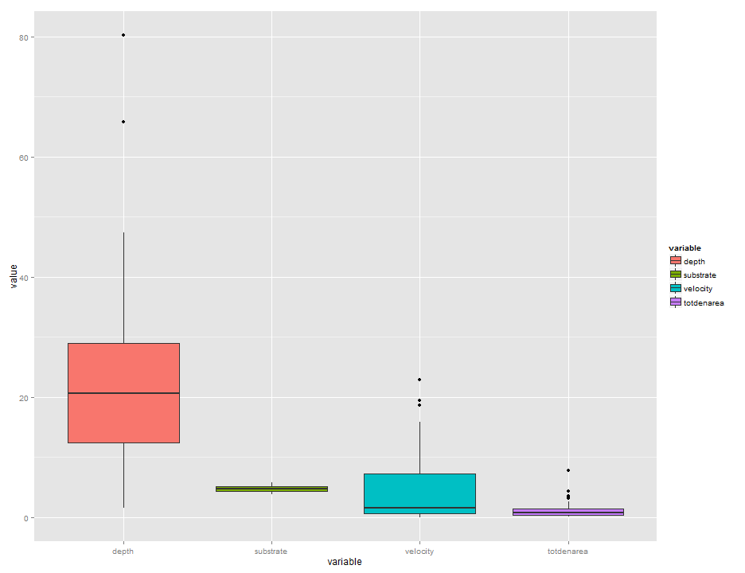
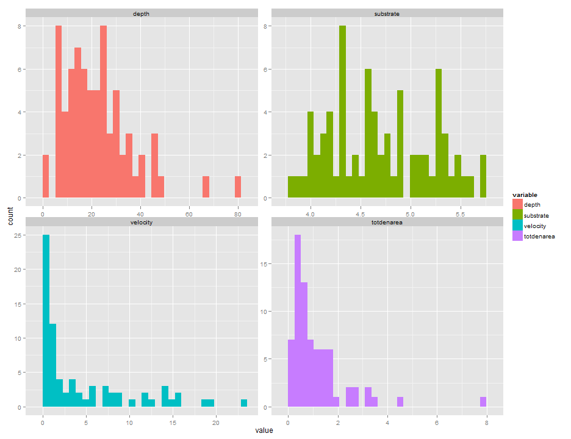
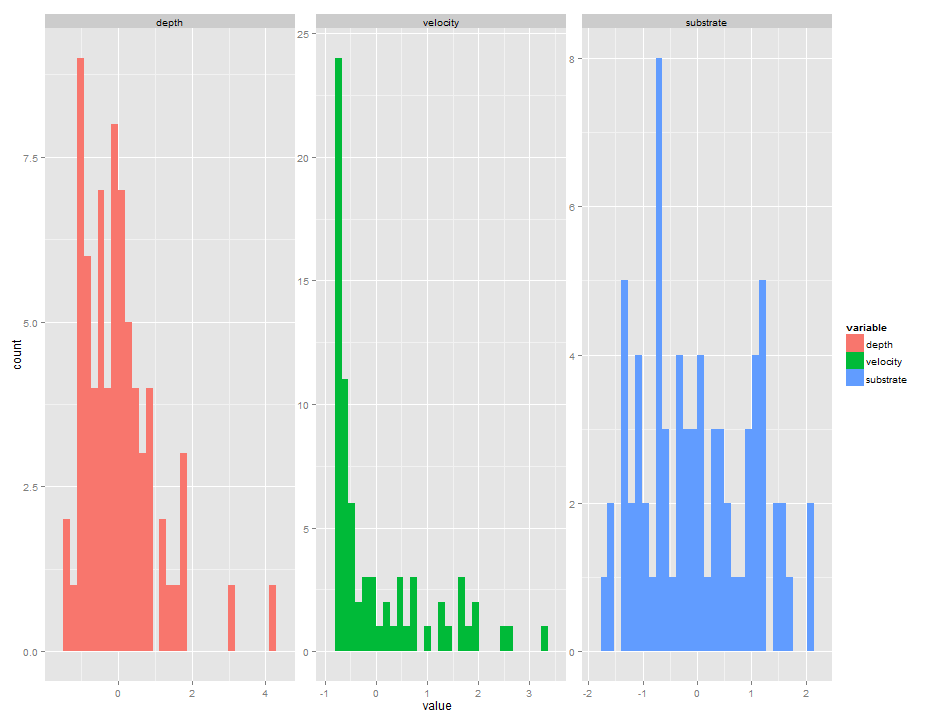
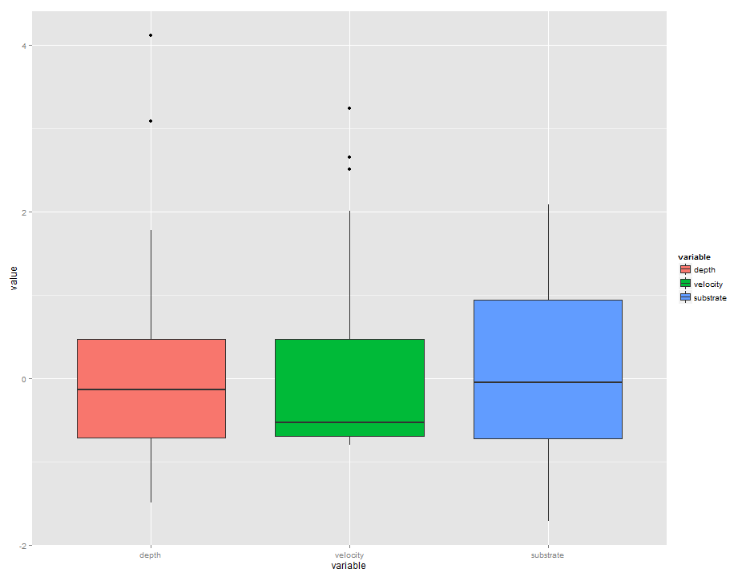
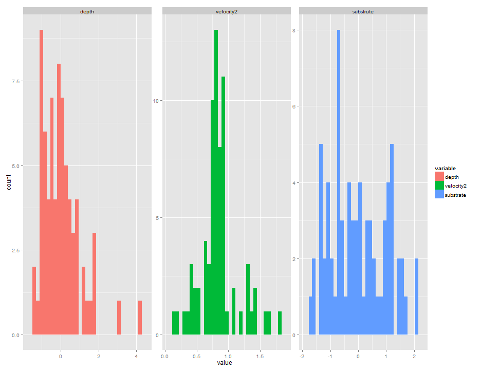
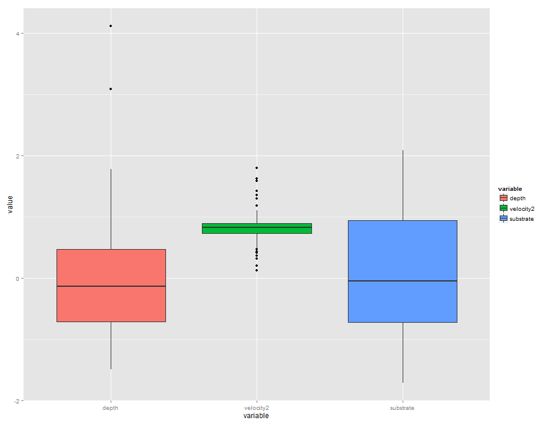
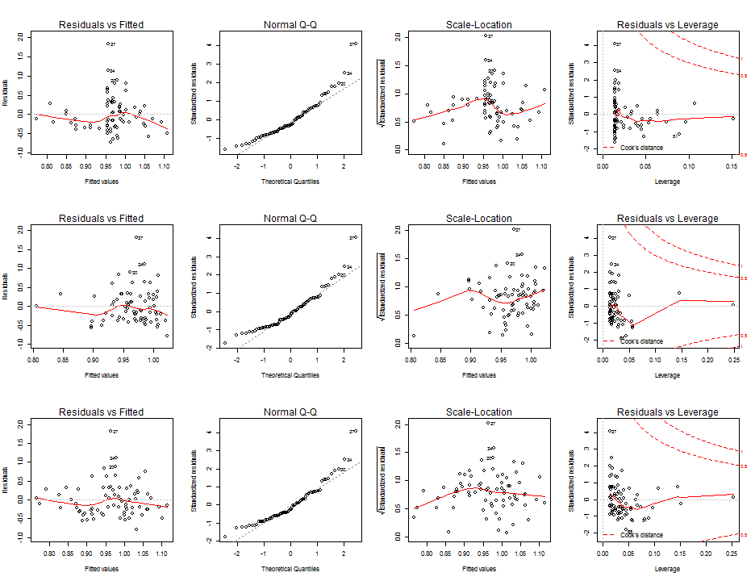

# Biometry Homework # 3
# Auriel Fournier
# Spring 2014
# Multiple Regression

```r
library(Hmisc)  #for the correlation stuff
```

```
## Loading required package: grid
## Loading required package: lattice
## Loading required package: survival
## Loading required package: splines
## Loading required package: Formula
## 
## Attaching package: 'Hmisc'
## 
## The following objects are masked from 'package:base':
## 
##     format.pval, round.POSIXt, trunc.POSIXt, units
```

```r
library(AICcmodavg)  #for AIC ranking
library(ggplot2)  #for graphing
library(reshape)  #for reshaping/melting 
```

```
## Loading required package: plyr
## 
## Attaching package: 'plyr'
## 
## The following objects are masked from 'package:Hmisc':
## 
##     is.discrete, summarize
## 
## 
## Attaching package: 'reshape'
## 
## The following objects are masked from 'package:plyr':
## 
##     rename, round_any
```

```r

setwd("C:/Users/avanderlaar/Dropbox/R/Biometry_HW_3")
hw3 = read.csv("biometryhw3.csv", header = T)

# subset just what we are interested in
hw3 = subset(hw3, hw3$stream == "Bear" | hw3$stream == "Cave" | hw3$stream == 
    "Falling")
# subset just what we want, ignoring columns with missing data
hw3 = subset(hw3, select = c("depth", "substrate", "velocity", "totdenarea"))

# visual examination puts the data into long form, instead of wide form
mel = melt(hw3)
```

```
## Using  as id variables
```

```r

# assumption of homogeneity of variance
ggplot() + geom_boxplot(data = mel, aes(x = variable, y = value, fill = variable))
```

 

```r

# assumption of normality
ggplot() + geom_histogram(data = mel, aes(x = value, fill = variable), position = position_dodge()) + 
    facet_wrap(~variable, scales = "free")
```

```
## stat_bin: binwidth defaulted to range/30. Use 'binwidth = x' to adjust this.
## stat_bin: binwidth defaulted to range/30. Use 'binwidth = x' to adjust this.
## stat_bin: binwidth defaulted to range/30. Use 'binwidth = x' to adjust this.
## stat_bin: binwidth defaulted to range/30. Use 'binwidth = x' to adjust this.
```

 

```r


# depth is a litle skewed substrate, looks alright totdenarea is skewed
# velocity is skewed

hw3nr = subset(hw3, select = c("depth", "velocity", "substrate"))
hw3nr = scale(hw3nr, center = T, scale = T)
hw3nr = data.frame(hw3nr)

mels = melt(hw3nr)
```

```
## Using  as id variables
```

```r

ggplot() + geom_histogram(data = mels, aes(x = value, fill = variable), position = position_dodge()) + 
    facet_wrap(~variable, scales = "free")
```

```
## stat_bin: binwidth defaulted to range/30. Use 'binwidth = x' to adjust this.
## stat_bin: binwidth defaulted to range/30. Use 'binwidth = x' to adjust this.
## stat_bin: binwidth defaulted to range/30. Use 'binwidth = x' to adjust this.
```

 

```r
ggplot() + geom_boxplot(data = mels, aes(x = variable, y = value, fill = variable))
```

 

```r

# transform to get close to a normal distribution
hw3nr$velocity2 = abs(hw3nr$velocity)^(1/2)

hw3nr = subset(hw3nr, select = c("depth", "velocity2", "substrate"))
melts = melt(hw3nr)
```

```
## Using  as id variables
```

```r

# look at everything again
ggplot() + geom_histogram(data = melts, aes(x = value, fill = variable), position = position_dodge()) + 
    facet_wrap(~variable, scales = "free")
```

```
## stat_bin: binwidth defaulted to range/30. Use 'binwidth = x' to adjust this.
## stat_bin: binwidth defaulted to range/30. Use 'binwidth = x' to adjust this.
## stat_bin: binwidth defaulted to range/30. Use 'binwidth = x' to adjust this.
```

 

```r
ggplot() + geom_boxplot(data = melts, aes(x = variable, y = value, fill = variable))
```

 

```r


hw3nr$totdenarea2 = hw3$totdenarea^(1/2)


# pearson's correlation
cor = rcorr(as.matrix(hw3nr), type = "pearson")

# because of the correlation we will keep these depth velocity2

# subset just what we are actually going to use
hw3f = subset(hw3nr, select = c("depth", "velocity2", "totdenarea2"))

# candidate models put into a list
cand.mod = list()
cand.mod[[1]] = lm(totdenarea2 ~ depth + velocity2, data = hw3f)
cand.mod[[2]] = lm(totdenarea2 ~ depth, data = hw3f)
cand.mod[[3]] = lm(totdenarea2 ~ velocity2, data = hw3f)


# list of the names for the models
names = c("model 1", "model 2", "model 3")

# generates AIC table
aictab(cand.mod, names, sort = T)
```

```
## 
## Model selection based on AICc :
## 
##         K  AICc Delta_AICc AICcWt Cum.Wt     LL
## model 3 3 95.02       0.00   0.47   0.47 -44.33
## model 2 3 95.83       0.81   0.31   0.78 -44.74
## model 1 4 96.49       1.47   0.22   1.00 -43.95
```

```r

# look in more detail at the top three models
summary(cand.mod[[3]])  # nothing is significant, and the R^2 is .01836
```

```
## 
## Call:
## lm(formula = totdenarea2 ~ velocity2, data = hw3f)
## 
## Residuals:
##    Min     1Q Median     3Q    Max 
## -0.719 -0.310 -0.117  0.223  1.835 
## 
## Coefficients:
##             Estimate Std. Error t value Pr(>|t|)    
## (Intercept)    1.134      0.155    7.30  3.3e-10 ***
## velocity2     -0.201      0.174   -1.15     0.25    
## ---
## Signif. codes:  0 '***' 0.001 '**' 0.01 '*' 0.05 '.' 0.1 ' ' 1
## 
## Residual standard error: 0.45 on 71 degrees of freedom
## Multiple R-squared:  0.0184,	Adjusted R-squared:  0.00453 
## F-statistic: 1.33 on 1 and 71 DF,  p-value: 0.253
```

```r
summary(cand.mod[[2]])  # none are significant,  R^2 =.007
```

```
## 
## Call:
## lm(formula = totdenarea2 ~ depth, data = hw3f)
## 
## Residuals:
##    Min     1Q Median     3Q    Max 
## -0.778 -0.338 -0.107  0.258  1.821 
## 
## Coefficients:
##             Estimate Std. Error t value Pr(>|t|)    
## (Intercept)   0.9654     0.0530   18.21   <2e-16 ***
## depth        -0.0388     0.0534   -0.73     0.47    
## ---
## Signif. codes:  0 '***' 0.001 '**' 0.01 '*' 0.05 '.' 0.1 ' ' 1
## 
## Residual standard error: 0.453 on 71 degrees of freedom
## Multiple R-squared:  0.00739,	Adjusted R-squared:  -0.00659 
## F-statistic: 0.529 on 1 and 71 DF,  p-value: 0.47
```

```r
summary(cand.mod[[1]])  # none are significant, R^2 = 0.02
```

```
## 
## Call:
## lm(formula = totdenarea2 ~ depth + velocity2, data = hw3f)
## 
## Residuals:
##    Min     1Q Median     3Q    Max 
## -0.787 -0.291 -0.117  0.267  1.828 
## 
## Coefficients:
##             Estimate Std. Error t value Pr(>|t|)    
## (Intercept)   1.1477     0.1564    7.34    3e-10 ***
## depth        -0.0461     0.0535   -0.86     0.39    
## velocity2    -0.2172     0.1754   -1.24     0.22    
## ---
## Signif. codes:  0 '***' 0.001 '**' 0.01 '*' 0.05 '.' 0.1 ' ' 1
## 
## Residual standard error: 0.451 on 70 degrees of freedom
## Multiple R-squared:  0.0287,	Adjusted R-squared:  0.000915 
## F-statistic: 1.03 on 2 and 70 DF,  p-value: 0.361
```

```r

par(mfrow = c(3, 4))
plot(cand.mod[[3]])  # 
plot(cand.mod[[2]])  #
plot(cand.mod[[1]])  #
```

 

