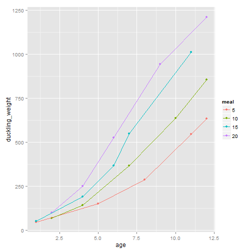

# biometry
# homework 4
# ancova
# Auriel Fournier
# April 28, 2014


```r

library(Hmisc)  #for the correlation stuff
```

```
## Loading required package: grid
## Loading required package: lattice
## Loading required package: survival
## Loading required package: splines
## Loading required package: Formula
## 
## Attaching package: 'Hmisc'
## 
## The following objects are masked from 'package:base':
## 
##     format.pval, round.POSIXt, trunc.POSIXt, units
```

```r
library(AICcmodavg)  #for AIC ranking
library(ggplot2)  #for graphing
library(reshape)  #for reshaping/melting 
```

```
## Loading required package: plyr
## 
## Attaching package: 'plyr'
## 
## The following objects are masked from 'package:Hmisc':
## 
##     is.discrete, summarize
## 
## 
## Attaching package: 'reshape'
## 
## The following objects are masked from 'package:plyr':
## 
##     rename, round_any
```

```r

# set working directory
setwd("C:/Users/avanderlaar/Dropbox/R/Biometry_HW_4")

# read in homework file
hw4 = read.csv("hw4.csv")

# the assignment says that meal_amount is categorical, so this makes it a
# factor
hw4$meal = factor(hw4$meal_amount, levels = c("5", "10", "15", "20"))


hw4$age_f = factor(hw4$age, levels = c("1", "2", "4", "5", "6", "7", "8", "9", 
    "10", "11", "12"))

# assumption of homogeneity of variance
ggplot() + geom_boxplot(data = hw4, aes(x = meal, y = duckling_weight, colour = meal)) + 
    geom_boxplot(data = hw4, aes(x = age, y = duckling_weight))
```

 

```r
# ok this doesn't look awful.

ggplot() + geom_histogram(data = hw4, aes(x = duckling_weight), position = position_dodge())
```

```
## stat_bin: binwidth defaulted to range/30. Use 'binwidth = x' to adjust this.
```

 

```r
# ok so we have a skewed distribution

hw4$duck2 = hw4$duckling_weight^(1/4)

ggplot() + geom_histogram(data = hw4, aes(x = duck2), position = position_dodge())
```

```
## stat_bin: binwidth defaulted to range/30. Use 'binwidth = x' to adjust this.
```

 

```r
# this is still funky, but is a bit better
ggplot() + geom_boxplot(data = hw4, aes(x = meal, y = duck2, colour = meal)) + 
    geom_boxplot(data = hw4, aes(x = age, y = duck2))
```

 

```r
# and this still looks ok

# One Way ANOVAS
lm1 = lm(data = hw4, duck2 ~ age)  #is significant
summary(lm1)
```

```
## 
## Call:
## lm(formula = duck2 ~ age, data = hw4)
## 
## Residuals:
##    Min     1Q Median     3Q    Max 
## -0.588 -0.260 -0.040  0.285  0.679 
## 
## Coefficients:
##             Estimate Std. Error t value Pr(>|t|)    
## (Intercept)   2.6312     0.1805    14.6  2.1e-11 ***
## age           0.2479     0.0236    10.5  4.1e-09 ***
## ---
## Signif. codes:  0 '***' 0.001 '**' 0.01 '*' 0.05 '.' 0.1 ' ' 1
## 
## Residual standard error: 0.39 on 18 degrees of freedom
## Multiple R-squared:  0.86,	Adjusted R-squared:  0.852 
## F-statistic:  111 on 1 and 18 DF,  p-value: 4.09e-09
```

```r
lm2 = lm(data = hw4, duck2 ~ meal)  # is not significant
summary(lm2)
```

```
## 
## Call:
## lm(formula = duck2 ~ meal, data = hw4)
## 
## Residuals:
##    Min     1Q Median     3Q    Max 
## -1.564 -0.717  0.120  0.829  1.389 
## 
## Coefficients:
##             Estimate Std. Error t value Pr(>|t|)    
## (Intercept)    4.018      0.480    8.36  3.1e-07 ***
## meal10         0.209      0.679    0.31     0.76    
## meal15         0.235      0.679    0.35     0.73    
## meal20         0.655      0.679    0.96     0.35    
## ---
## Signif. codes:  0 '***' 0.001 '**' 0.01 '*' 0.05 '.' 0.1 ' ' 1
## 
## Residual standard error: 1.07 on 16 degrees of freedom
## Multiple R-squared:  0.0576,	Adjusted R-squared:  -0.119 
## F-statistic: 0.326 on 3 and 16 DF,  p-value: 0.807
```

```r

# Look at the interaction between the two predictors
lm3 = lm(data = hw4, age ~ meal)  # not significant 
summary(lm3)
```

```
## 
## Call:
## lm(formula = age ~ meal, data = hw4)
## 
## Residuals:
##    Min     1Q Median     3Q    Max 
##  -6.40  -2.70   0.10   3.15   5.40 
## 
## Coefficients:
##             Estimate Std. Error t value Pr(>|t|)    
## (Intercept)     7.40       1.83    4.05  0.00093 ***
## meal10         -0.40       2.58   -0.15  0.87894    
## meal15         -1.60       2.58   -0.62  0.54459    
## meal20         -0.80       2.58   -0.31  0.76091    
## ---
## Signif. codes:  0 '***' 0.001 '**' 0.01 '*' 0.05 '.' 0.1 ' ' 1
## 
## Residual standard error: 4.09 on 16 degrees of freedom
## Multiple R-squared:  0.0255,	Adjusted R-squared:  -0.157 
## F-statistic: 0.14 on 3 and 16 DF,  p-value: 0.935
```

```r

# linearity assumptions
ggplot() + geom_point(data = hw4, aes(x = age, y = duckling_weight, colour = meal)) + 
    geom_line(data = hw4, aes(x = age, y = duckling_weight, colour = meal))
```

 

```r

lm4 = lm(data = hw4, duck2 ~ age + meal)
summary(lm4)
```

```
## 
## Call:
## lm(formula = duck2 ~ age + meal, data = hw4)
## 
## Residuals:
##     Min      1Q  Median      3Q     Max 
## -0.3240 -0.1107 -0.0108  0.1199  0.2756 
## 
## Coefficients:
##             Estimate Std. Error t value Pr(>|t|)    
## (Intercept)   2.1055     0.1298   16.23  6.4e-11 ***
## age           0.2584     0.0125   20.71  1.9e-12 ***
## meal10        0.3121     0.1291    2.42  0.02880 *  
## meal15        0.6480     0.1305    4.97  0.00017 ***
## meal20        0.8614     0.1294    6.66  7.6e-06 ***
## ---
## Signif. codes:  0 '***' 0.001 '**' 0.01 '*' 0.05 '.' 0.1 ' ' 1
## 
## Residual standard error: 0.204 on 15 degrees of freedom
## Multiple R-squared:  0.968,	Adjusted R-squared:  0.96 
## F-statistic:  114 on 4 and 15 DF,  p-value: 4.88e-11
```

```r

par(mfrow = c(2, 2))
plot(lm4)
```

 

```r

# check for paralell slopes
lm5 = lm(data = hw4, duck2 ~ age * meal)
summary(lm5)
```

```
## 
## Call:
## lm(formula = duck2 ~ age * meal, data = hw4)
## 
## Residuals:
##      Min       1Q   Median       3Q      Max 
## -0.26089 -0.08227  0.00102  0.03964  0.27962 
## 
## Coefficients:
##             Estimate Std. Error t value Pr(>|t|)    
## (Intercept)   2.3937     0.1683   14.22  7.1e-09 ***
## age           0.2195     0.0200   10.99  1.3e-07 ***
## meal10        0.0414     0.2411    0.17    0.867    
## meal15        0.1203     0.2338    0.51    0.616    
## meal20        0.4616     0.2390    1.93    0.077 .  
## age:meal10    0.0364     0.0296    1.23    0.242    
## age:meal15    0.0802     0.0315    2.55    0.025 *  
## age:meal20    0.0559     0.0302    1.85    0.089 .  
## ---
## Signif. codes:  0 '***' 0.001 '**' 0.01 '*' 0.05 '.' 0.1 ' ' 1
## 
## Residual standard error: 0.18 on 12 degrees of freedom
## Multiple R-squared:  0.98,	Adjusted R-squared:  0.969 
## F-statistic: 84.7 on 7 and 12 DF,  p-value: 2.91e-09
```

